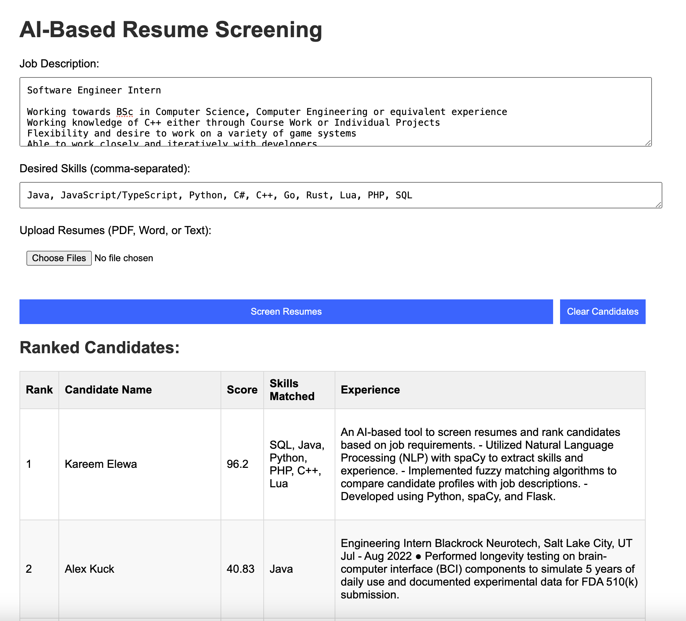

# AI-Based Resume Screening App

An AI-based web application to screen resumes and rank candidates based on a job description and desired skills. The app uses Natural Language Processing (NLP) to extract key skills, experience, and the candidate's name from uploaded resumes. Candidates are ranked according to their skill match score relative to the job description.

## **Features**

- **Name Extraction**: Extracts the candidate's name from each resume using spaCy's NLP capabilities.
- **Skill Matching**: Allows user to input a list of skills relevant to the job description, which are used for skill extraction and matching.
- **Candidate Ranking**: Ranks candidates based on how closely their skills match the job description.
- **Session Management**: Uses server-side sessions to retain candidate data across multiple submissions.
- **Clear Functionality**: Provides a button to clear the candidates list.

## **Technologies Used**

- **Python**: Backend logic
- **Flask**: Web framework
- **spaCy**: NLP library for name and skill extraction
- **rapidfuzz**: Library for calculating match scores
- **PyPDF2** and **python-docx**: Libraries for reading PDF and Word files

## **Setup Instructions**

### **1. Clone the Repository**

```bash
git clone https://github.com/kareemxyz/resume-screening-app.git
cd resume-screening-app
```

### **2. Set Up a Virtual Environment**

Create and activate a virtual environment to manage dependencies:

```bash
python3.11 -m venv env
source env/bin/activate  # On Windows, use `env\Scripts\activate`
```

### **3. Install Dependencies**

Install the required packages listed in `requirements.txt`:

```bash
pip install -r requirements.txt
python -m spacy download en_core_web_md
```

### **4. Run the Application**

```bash
python app.py
```

The app will be accessible at `http://127.0.0.1:5000/`.

## **Usage**

1. **Input Job Description**: Enter the job description in the designated text area.
2. **Input Desired Skills**: Enter a comma-separated list of relevant skills.
3. **Upload Resumes**: Upload resumes in PDF, Word (.doc/.docx), or text format.
4. **Screen Resumes**: Click the "Screen Resumes" button to rank the candidates.
5. **View Results**: View a table displaying the candidates' names, scores, matched skills, and experience.
6. **Clear Candidates**: Click "Clear Candidates" to reset the candidates list.
